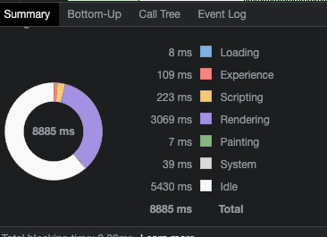

# SqlQueryResultVisualizer

## Basic Overview

This web-based application allows users to run SQL queries and view the results. The application is designed to be easy to use and efficient, even when dealing with large amounts of data.

The user interface is simple and intuitive, and provides helpful tooltips. The Application optimized for performance, so it can handle even large amounts of data without breaking the browser or crashing. It could be valuable tool for data analysts and other users who need to work with large amounts of data.

The application is built using popular JavaScript framework [Angular](https://angular.io/quick-start) version 16.1.6. Using [Angular Material](https://material.angular.io/) to leverage their components, [Tailwind CSS](https://tailwindcss.com/) to avoid writing basic style into the component css.

Application deployed on Vercel, here is the demo link [https://sql-query-result-visualizer.vercel.app](https://sql-query-result-visualizer.vercel.app/).

The application includes the following features:

1. A space to enter SQL queries.
2. Press Run button or ENTER key to run the queries.
3. A table to display the results of the queries with pagination.
4. While Query is running user can stop it immediately.

## Optimisations Insight

Initially thought to use Infinite scroll where user can scroll to the bottom and new data can be fetched. This may be a modern solution but it got some downsides as well. Lets, say if we have millions of data user need to scroll and scroll and scroll and so on, also at some point DOM memory can get full which leads to browser snapiness.

Then, I got idea to use pagination in table. Pagination is generally considered to be a more reliable approach, as it is less likely to cause the user interface to feel unresponsive.

Here are some factors to consider when choosing between pagination and infinite scroll:

 - The size of the dataset: If you have a large dataset, then pagination may be a better option, as it can help to improve performance.
 - The type of data: If the data is static, then pagination may be a better option, as it can be easier to implement.
 - The user experience: If you want to provide a user-friendly experience, then infinite scroll may be a better option.

So, I concluded to use Pagination which is apt to analyze data with each set on consecutive pages.

## Overcome Snappiness

As I expected the application to load large set of data without breaking browser. I tried to load million of rows in table. Browser tab got hung and I saw snap message.

If I have backend pagination available via API, I can easily show set of rows in each page with each network call. But, here User/Data analyst need wait for few bit of a second on each page interval.

If I have the large amount of data loaded together on the table, on each consecutive page visit I dont need to wait for API to respond. This sounds like a nice plan. But again doing that, browser got crashed because I have loaded the data on main thread of JS engine which blocks all other browser components to be responsive. So, I have used **web worker** file to take care of data downloading as seperate thread. Once whole data got downloaded, I can communicate to worker to get each set of paginated rows. In this way, I dont see any major issues handling huge data set.

## Page Load Time

Here is the page load time summary which is recorded from chrome performance tool.

But for our application, page load time doesn't matter, as it matters when data loading on to the DOM.

My Main goal is to keep the application stable, accessible and easy to handle large data.

As per my implementation, data load is solely depends on size of the data, capacity of the browser to take the dataload. From Frontend perspective, I am showing required amount of data to the users viewport.
